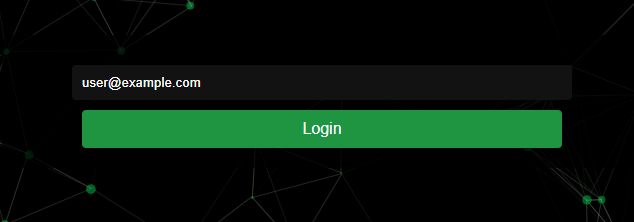
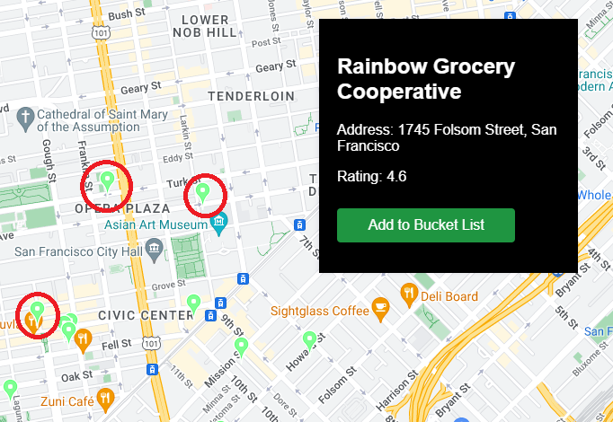
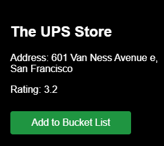

# Locality App
Welcome to the Locality App! This application helps users explore nearby businesses and add them to their bucket list for future reference. Below is a guide to help you understand the project structure, setup instructions, and the key functionalities.

## Milestone-03 requirements

### 1. Project Structure:

We have a root dir called src, with client, server, and docs (milestone-01). 
1. #### client:
   contains js, html and css files
1. #### server:
   db.js, server.js

### 2. Server setup: 
express.js in server .js deployed and fulfils all requirements of the project

### 3. DB: 
performs CRUD and properly initialized.

### .4. API Routes:

All implemented in context to the "bucket list" feature in server.js

### .5. Front-end Integration:

works for the bucket list, maps, login methods.

### 6. Error Handling:
all done! see code for it,

### 7. Development Script: 
npm start loads all servers. 

"start": "concurrently \"npm run start-server\" \"parcel src/client/html/index.html src/client/html/map.html\"",
"build": "parcel build src/client/html/index.html src/client/html/map.html"

.9. Documentation: ✅

------------------------------

## Setup instructions
Step 1: Clone the repository to your local machine.

            git clone https://github.com/tkachwala/CS326.git

Step 2: Open the VSCode terminal and write this command

            npm install

Step 3: After the installation, write this command

            npm run milestone-02

## Key Functionalities
1. Login: Users can log in to the application using their email address. Only the email "user@example.com" is accepted for login right now.

   

2. Map Display: The map.html page shows a Google Map with nearby locations marked.
   
   

3. Filter Option: The filter option allows you to customize your search based on your preference.

   

4. Bucket List: Users can add locations to their bucket list by clicking on the "Add to Bucket List" button on the map.

    

5. Help Screen: Clicking on the "Help" button displays information and support options for users.

   

## Note
To access the application, use the email address "user1@example.com" with password "pass".

